# ENTITY RELATIONSHIP DIAGRAM (ERD) - CAFINITY POS

Dokumen ini mendokumentasikan desain database relasional untuk sistem **Cafinity POS** (Point of Sale & Cafe Management System). Rancangan database ini disusun untuk mendukung operasional transaksi kasir, kalkulasi HPP otomatis (Recipe Costing), manajemen stok bahan baku, antrean dapur digital, dan purchase order secara konsisten dan terintegrasi. Dokumen ini disiapkan sebagai pendukung penulisan Bab 3 (Perancangan Database) Skripsi.

---

## 1. Diagram ERD (Mermaid.js)

Berikut adalah diagram hubungan entitas (ERD) yang memperlihatkan tabel-tabel database, field, tipe data, *primary key* (PK), *foreign key* (FK), serta kardinalitas relasi antar entitas.

```mermaid
erDiagram
    USERS {
        bigint id PK
        string name
        string email UK
        timestamp email_verified_at
        string password
        string role
        enum status
        timestamp shift_terakhir
        boolean two_fa_enabled
        string two_fa_method
        string two_fa_secret
        timestamp last_login
        string remember_token
        timestamp created_at
        timestamp updated_at
    }

    CATEGORIES {
        bigint id PK
        string name
        string slug UK
        string description
        boolean is_active
        timestamp created_at
        timestamp updated_at
    }

    MENUS {
        bigint id PK
        bigint category_id FK
        string name
        string slug UK
        text description
        int price
        string image
        boolean is_active
        timestamp created_at
        timestamp updated_at
    }

    SUPPLIERS {
        bigint id PK
        string name
        string phone
        string email
        text address
        string city
        string province
        string category
        string payment_term
        int lead_time
        decimal min_order
        string status
        decimal rating
        text notes
        string code UK
        boolean is_active
        timestamp created_at
        timestamp updated_at
    }

    INVENTORY_CATEGORIES {
        bigint id PK
        string name
        timestamp created_at
        timestamp updated_at
    }

    INVENTORIES {
        bigint id PK
        bigint inventory_category_id FK
        bigint supplier_id FK
        string name
        string unit
        double stock
        double min_stock
        int price_per_unit
        timestamp created_at
        timestamp updated_at
    }

    INVENTORY_LOGS {
        bigint id PK
        bigint inventory_id FK
        bigint user_id FK
        enum type
        double qty
        double stock_before
        double stock_after
        text notes
        timestamp created_at
        timestamp updated_at
    }

    RECIPES {
        bigint id PK
        bigint menu_id FK "unique"
        int total_hpp
        text notes
        timestamp created_at
        timestamp updated_at
    }

    RECIPE_INGREDIENTS {
        bigint id PK
        bigint recipe_id FK
        bigint inventory_id FK
        double qty
        string unit
        timestamp created_at
        timestamp updated_at
    }

    TRANSACTIONS {
        bigint id PK
        bigint cashier_id FK
        enum status
        int total_amount
        int discount
        int tax
        string payment_method
        int paid_amount
        int change_amount
        text notes
        timestamp created_at
        timestamp updated_at
    }

    TRANSACTION_ITEMS {
        bigint id PK
        bigint transaction_id FK
        bigint menu_id FK
        int qty
        int price
        int discount
        int subtotal
        string notes
        timestamp created_at
        timestamp updated_at
    }

    KITCHEN_ORDERS {
        bigint id PK
        bigint transaction_id FK "unique"
        enum status
        text notes
        timestamp prepared_at
        timestamp completed_at
        timestamp created_at
        timestamp updated_at
    }

    KITCHEN_ORDER_ITEMS {
        bigint id PK
        bigint kitchen_order_id FK
        bigint menu_id FK
        int qty
        string notes
        timestamp created_at
        timestamp updated_at
    }

    PURCHASE_ORDERS {
        bigint id PK
        bigint supplier_id FK
        bigint user_id FK
        string po_number UK
        date delivery_date
        string delivery_location
        string reference_number
        enum status
        int total_amount
        text notes
        bigint created_by FK
        timestamp approved_at
        timestamp ordered_at
        timestamp received_at
        timestamp created_at
        timestamp updated_at
    }

    PURCHASE_ORDER_ITEMS {
        bigint id PK
        bigint purchase_order_id FK
        bigint inventory_id FK
        double qty
        string unit
        int price_per_unit
        int subtotal
        timestamp created_at
        timestamp updated_at
    }

    PROMOTIONS {
        bigint id PK
        string name
        enum type
        int value
        int min_purchase
        date start_date
        date end_date
        boolean is_active
        timestamp created_at
        timestamp updated_at
    }

    BUNDLES {
        bigint id PK
        string name
        text description
        int price
        boolean is_active
        timestamp created_at
        timestamp updated_at
    }

    BUNDLE_ITEMS {
        bigint id PK
        bigint bundle_id FK
        bigint menu_id FK
        int qty
        timestamp created_at
        timestamp updated_at
    }

    TARGETS {
        bigint id PK
        string label
        enum type
        bigint target_value
        bigint current_value
        string period
        date start_date
        date end_date
        timestamp created_at
        timestamp updated_at
    }

    SETTINGS {
        bigint id PK
        string key UK
        text value
        string group
        timestamp created_at
        timestamp updated_at
    }

    AUDIT_LOGS {
        bigint id PK
        bigint user_id FK
        string action
        string target_type
        bigint target_id
        json metadata
        timestamp created_at
        timestamp updated_at
    }

    SUPPLIER_CONTACTS {
        bigint id PK
        bigint supplier_id FK
        string name
        string phone
        string email
        string position
        boolean is_primary
        timestamp created_at
        timestamp updated_at
    }

    SUPPLIER_DOCUMENTS {
        bigint id PK
        bigint supplier_id FK
        string type
        string filename
        string path
        bigint uploaded_by FK
        timestamp uploaded_at
        timestamp created_at
        timestamp updated_at
    }

    PO_APPROVALS {
        bigint id PK
        bigint purchase_order_id FK
        bigint approver_id FK
        string status
        text notes
        int level
        timestamp acted_at
        timestamp created_at
        timestamp updated_at
    }

    USER_SESSIONS {
        bigint id PK
        bigint user_id FK
        string device
        string browser
        string ip_address
        string location
        timestamp last_activity
        timestamp created_at
        timestamp updated_at
    }

    %% ==========================================
    %% KARDINALITAS RELASI (CARDINALITIES)
    %% ==========================================
    
    %% Relasi Pengguna (Users)
    USERS ||--o{ TRANSACTIONS : "kasir_id"
    USERS ||--o{ INVENTORY_LOGS : "user_id"
    USERS ||--o{ PURCHASE_ORDERS : "user_id"
    USERS ||--o{ AUDIT_LOGS : "user_id"
    USERS ||--o{ USER_SESSIONS : "user_id"
    USERS ||--o{ SUPPLIER_DOCUMENTS : "uploaded_by"
    USERS ||--o{ PO_APPROVALS : "approver_id"
    USERS ||--o{ PURCHASE_ORDERS : "created_by"

    %% Relasi Katalog Menu
    CATEGORIES ||--o{ MENUS : "category_id"
    MENUS ||--|| RECIPES : "menu_id (1:1)"
    MENUS ||--o{ TRANSACTION_ITEMS : "menu_id"
    MENUS ||--o{ KITCHEN_ORDER_ITEMS : "menu_id"
    MENUS ||--o{ BUNDLE_ITEMS : "menu_id"
    BUNDLES ||--o{ BUNDLE_ITEMS : "bundle_id"

    %% Relasi Inventaris & Pemasok
    SUPPLIERS ||--o{ INVENTORIES : "supplier_id"
    SUPPLIERS ||--o{ PURCHASE_ORDERS : "supplier_id"
    SUPPLIERS ||--o{ SUPPLIER_CONTACTS : "supplier_id"
    SUPPLIERS ||--o{ SUPPLIER_DOCUMENTS : "supplier_id"
    INVENTORY_CATEGORIES ||--o{ INVENTORIES : "inventory_category_id"
    INVENTORIES ||--o{ INVENTORY_LOGS : "inventory_id"
    INVENTORIES ||--o{ RECIPE_INGREDIENTS : "inventory_id"
    INVENTORIES ||--o{ PURCHASE_ORDER_ITEMS : "inventory_id"
    
    %% Relasi Resep
    RECIPES ||--o{ RECIPE_INGREDIENTS : "recipe_id"

    %% Relasi Transaksi & Antrean Dapur
    TRANSACTIONS ||--o{ TRANSACTION_ITEMS : "transaction_id"
    TRANSACTIONS ||--|o KITCHEN_ORDERS : "transaction_id (1:1)"
    KITCHEN_ORDERS ||--o{ KITCHEN_ORDER_ITEMS : "kitchen_order_id"

    %% Relasi Pengadaan (PO)
    PURCHASE_ORDERS ||--o{ PURCHASE_ORDER_ITEMS : "purchase_order_id"
    PURCHASE_ORDERS ||--o{ PO_APPROVALS : "purchase_order_id"
```



---

## 2. Diagram ERD Notasi Chen (Konseptual - Simbol Kotak, Oval & Belah Ketupat)

Diagram di bawah ini menyajikan **ERD Notasi Chen** (Conceptual ERD) yang sering digunakan dalam penulisan akademis (Skripsi). Diagram ini memisahkan secara visual antara **Entitas** (simbol Kotak/Persegi Panjang), **Atribut** (simbol Oval/Kapsul), dan **Relasi** (simbol Belah Ketupat/Diamond) beserta garis penghubung yang berlabel nilai kardinalitas hubungan ($1, N, M$).

```mermaid
flowchart TD
    %% ==========================================
    %% DEFINISI STYLING & CLASS (Chen Notation)
    %% ==========================================
    classDef entity fill:#e1f5fe,stroke:#0288d1,stroke-width:2px,color:#01579b;
    classDef attribute fill:#f5f5f5,stroke:#9e9e9e,stroke-width:1px,color:#212121;
    classDef relation fill:#fff3e0,stroke:#f57c00,stroke-width:2px,color:#e65100;

    %% ==========================================
    %% ENTITAS (RECTANGLES)
    %% ==========================================
    USERS[USERS] ::: entity
    CATEGORIES[CATEGORIES] ::: entity
    MENUS[MENUS] ::: entity
    RECIPES[RECIPES] ::: entity
    INVENTORIES[INVENTORIES] ::: entity
    SUPPLIERS[SUPPLIERS] ::: entity
    TRANSACTIONS[TRANSACTIONS] ::: entity
    KITCHEN_ORDERS[KITCHEN_ORDERS] ::: entity
    PURCHASE_ORDERS[PURCHASE_ORDERS] ::: entity
    SUPPLIER_CONTACTS[SUPPLIER_CONTACTS] ::: entity
    SUPPLIER_DOCUMENTS[SUPPLIER_DOCUMENTS] ::: entity
    PO_APPROVALS[PO_APPROVALS] ::: entity
    USER_SESSIONS[USER_SESSIONS] ::: entity

    %% ==========================================
    %% ATRIBUT UTAMA (OVALS / STADIUMS)
    %% ==========================================
    %% Atribut USERS
    U_id([<u>id</u>]) ::: attribute
    U_name([name]) ::: attribute
    U_role([role]) ::: attribute
    
    %% Atribut CATEGORIES
    C_id([<u>id</u>]) ::: attribute
    C_name([name]) ::: attribute
    
    %% Atribut MENUS
    M_id([<u>id</u>]) ::: attribute
    M_name([name]) ::: attribute
    M_price([price]) ::: attribute
    
    %% Atribut RECIPES
    R_id([<u>id</u>]) ::: attribute
    R_hpp([total_hpp]) ::: attribute
    
    %% Atribut INVENTORIES
    I_id([<u>id</u>]) ::: attribute
    I_name([name]) ::: attribute
    I_stock([stock]) ::: attribute
    
    %% Atribut SUPPLIERS
    S_id([<u>id</u>]) ::: attribute
    S_name([name]) ::: attribute
    
    %% Atribut TRANSACTIONS
    T_id([<u>id</u>]) ::: attribute
    T_total([total_amount]) ::: attribute
    T_method([payment_method]) ::: attribute
    
    %% Atribut KITCHEN_ORDERS
    K_id([<u>id</u>]) ::: attribute
    K_status([status]) ::: attribute
    
    %% Atribut PURCHASE_ORDERS
    P_id([<u>id</u>]) ::: attribute
    P_total([total_amount]) ::: attribute

    %% Atribut dari Relasi Banyak-ke-Banyak (M:N)
    TI_qty([qty]) ::: attribute
    RI_qty([qty]) ::: attribute
    POI_qty([qty]) ::: attribute

    %% Atribut SUPPLIER_CONTACTS
    SC_id([<u>id</u>]) ::: attribute
    SC_name([name]) ::: attribute

    %% Atribut SUPPLIER_DOCUMENTS
    SD_id([<u>id</u>]) ::: attribute
    SD_filename([filename]) ::: attribute

    %% Atribut PO_APPROVALS
    PA_id([<u>id</u>]) ::: attribute
    PA_status([status]) ::: attribute

    %% Atribut USER_SESSIONS
    SE_id([<u>id</u>]) ::: attribute
    SE_device([device]) ::: attribute

    %% ==========================================
    %% RELASI / HUBUNGAN (DIAMONDS)
    %% ==========================================
    Rel_User_Tx{mencatat} ::: relation
    Rel_User_PO{membuat} ::: relation
    Rel_Cat_Menu{memiliki} ::: relation
    Rel_Menu_Rec{memiliki} ::: relation
    Rel_Menu_Tx{terdapat_pada} ::: relation
    Rel_Rec_Inv{memerlukan} ::: relation
    Rel_Sup_Inv{menyuplai} ::: relation
    Rel_Sup_PO{menerima} ::: relation
    Rel_PO_Inv{memesan} ::: relation
    Rel_Tx_KO{memicu} ::: relation
    Rel_Sup_SC{memiliki_pic} ::: relation
    Rel_Sup_SD{menyertakan_dokumen} ::: relation
    Rel_User_SD{mengunggah_dokumen} ::: relation
    Rel_PO_PA{membutuhkan_approval} ::: relation
    Rel_User_PA{menyetujui_po} ::: relation
    Rel_User_SE{memiliki_sesi} ::: relation

    %% ==========================================
    %% GARIS HUBUNG ENTITAS - ATRIBUT & RELASI
    %% ==========================================
    
    %% USERS
    USERS --- U_id
    USERS --- U_name
    USERS --- U_role
    USERS ---|1| Rel_User_Tx
    USERS ---|1| Rel_User_PO
    USERS ---|1| Rel_User_SD
    USERS ---|1| Rel_User_PA
    USERS ---|1| Rel_User_SE

    %% CATEGORIES
    CATEGORIES --- C_id
    CATEGORIES --- C_name
    CATEGORIES ---|1| Rel_Cat_Menu

    %% MENUS
    MENUS --- M_id
    MENUS --- M_name
    MENUS --- M_price
    MENUS ---|N| Rel_Cat_Menu
    MENUS ---|1| Rel_Menu_Rec
    MENUS ---|M| Rel_Menu_Tx

    %% RECIPES
    RECIPES --- R_id
    RECIPES --- R_hpp
    RECIPES ---|1| Rel_Menu_Rec
    RECIPES ---|M| Rel_Rec_Inv

    %% INVENTORIES
    INVENTORIES --- I_id
    INVENTORIES --- I_name
    INVENTORIES --- I_stock
    INVENTORIES ---|N| Rel_Rec_Inv
    INVENTORIES ---|N| Rel_Sup_Inv
    INVENTORIES ---|N| Rel_PO_Inv

    %% SUPPLIERS
    SUPPLIERS --- S_id
    SUPPLIERS --- S_name
    SUPPLIERS ---|1| Rel_Sup_Inv
    SUPPLIERS ---|1| Rel_Sup_PO
    SUPPLIERS ---|1| Rel_Sup_SC
    SUPPLIERS ---|1| Rel_Sup_SD

    %% TRANSACTIONS
    TRANSACTIONS --- T_id
    TRANSACTIONS --- T_total
    TRANSACTIONS --- T_method
    TRANSACTIONS ---|N| Rel_User_Tx
    TRANSACTIONS ---|N| Rel_Menu_Tx
    TRANSACTIONS ---|1| Rel_Tx_KO

    %% KITCHEN_ORDERS
    KITCHEN_ORDERS --- K_id
    KITCHEN_ORDERS --- K_status
    KITCHEN_ORDERS ---|1| Rel_Tx_KO

    %% PURCHASE_ORDERS
    PURCHASE_ORDERS --- P_id
    PURCHASE_ORDERS --- P_total
    PURCHASE_ORDERS ---|N| Rel_User_PO
    PURCHASE_ORDERS ---|N| Rel_Sup_PO
    PURCHASE_ORDERS ---|M| Rel_PO_Inv
    PURCHASE_ORDERS ---|1| Rel_PO_PA

    %% SUPPLIER_CONTACTS
    SUPPLIER_CONTACTS --- SC_id
    SUPPLIER_CONTACTS --- SC_name
    SUPPLIER_CONTACTS ---|N| Rel_Sup_SC

    %% SUPPLIER_DOCUMENTS
    SUPPLIER_DOCUMENTS --- SD_id
    SUPPLIER_DOCUMENTS --- SD_filename
    SUPPLIER_DOCUMENTS ---|N| Rel_Sup_SD
    SUPPLIER_DOCUMENTS ---|N| Rel_User_SD

    %% PO_APPROVALS
    PO_APPROVALS --- PA_id
    PO_APPROVALS --- PA_status
    PO_APPROVALS ---|N| Rel_PO_PA
    PO_APPROVALS ---|N| Rel_User_PA

    %% USER_SESSIONS
    USER_SESSIONS --- SE_id
    USER_SESSIONS --- SE_device
    USER_SESSIONS ---|N| Rel_User_SE

    %% Menghubungkan Atribut Relasi
    Rel_Menu_Tx --- TI_qty
    Rel_Rec_Inv --- RI_qty
    Rel_PO_Inv --- POI_qty
```

---

## 3. Kamus Data (Data Dictionary)

Berikut adalah spesifikasi kolom untuk setiap entitas/tabel yang ada di dalam sistem Cafinity POS:

### 1. Tabel `users`
Tabel ini digunakan untuk menyimpan data identitas karyawan kafe (owner, admin, kasir).
*   `id` (BIGINT, PK, Auto Increment): ID unik pengguna.
*   `name` (VARCHAR): Nama lengkap karyawan.
*   `email` (VARCHAR, Unique): Alamat email untuk kredensial login.
*   `email_verified_at` (TIMESTAMP, Nullable): Waktu email diverifikasi.
*   `password` (VARCHAR): Kata sandi terenkripsi (bcrypt).
*   `role` (VARCHAR): Peran hak akses staf (default: `'cashier'`).
*   `status` (ENUM: `'active'`, `'inactive'`, `'pending'`, `'deactivated'`): Status keaktifan akun (default: `'active'`).
*   `shift_terakhir` (TIMESTAMP, Nullable): Waktu shift kerja kasir terakhir kali dibuka.
*   `two_fa_enabled` (TINYINT): Status 2FA aktif atau tidak (default: `0`).
*   `two_fa_method` (VARCHAR, Nullable): Metode 2FA yang digunakan.
*   `two_fa_secret` (VARCHAR, Nullable): Secret key untuk autentikasi TOTP.
*   `last_login` (TIMESTAMP, Nullable): Waktu aktivitas login terakhir pengguna.
*   `remember_token` (VARCHAR, Nullable): Token untuk remember me login.
*   `created_at` (TIMESTAMP, Nullable)
*   `updated_at` (TIMESTAMP, Nullable)

### 2. Tabel `categories`
Tabel ini mengelompokkan menu makanan dan minuman (contoh: Coffee, Non-Coffee, Pastry).
*   `id` (BIGINT, PK, Auto Increment): ID unik kategori menu.
*   `name` (VARCHAR): Nama kategori.
*   `slug` (VARCHAR, Unique): Slug URL kategori.
*   `description` (VARCHAR, Nullable): Deskripsi detail kategori.
*   `is_active` (TINYINT): Status keaktifan kategori (default: `1`).
*   `created_at` (TIMESTAMP, Nullable)
*   `updated_at` (TIMESTAMP, Nullable)

### 3. Tabel `menus`
Tabel yang menampung daftar produk/hidangan yang dijual ke pelanggan.
*   `id` (BIGINT, PK, Auto Increment): ID unik menu.
*   `category_id` (BIGINT, FK ke `categories`): Kategori menu.
*   `name` (VARCHAR): Nama menu hidangan.
*   `slug` (VARCHAR, Unique): Slug URL menu.
*   `description` (TEXT, Nullable): Deskripsi detail menu.
*   `price` (UNSIGNED INT): Harga jual menu (default: `0`).
*   `image` (VARCHAR, Nullable): Path file gambar menu.
*   `is_active` (TINYINT): Status menu dapat dipesan atau tidak (default: `1`).
*   `created_at` (TIMESTAMP, Nullable)
*   `updated_at` (TIMESTAMP, Nullable)

### 4. Tabel `suppliers`
Tabel penyedia bahan baku mentah untuk operasional kafe.
*   `id` (BIGINT, PK, Auto Increment): ID unik supplier.
*   `name` (VARCHAR): Nama supplier / badan usaha.
*   `phone` (VARCHAR, Nullable): Nomor kontak supplier.
*   `email` (VARCHAR, Nullable): Kontak email utama.
*   `address` (TEXT, Nullable): Alamat pengiriman utama.
*   `city` (VARCHAR, Nullable): Kota lokasi supplier.
*   `province` (VARCHAR, Nullable): Provinsi lokasi supplier.
*   `category` (VARCHAR, Nullable): Kategori penyuplaian (contoh: `'Bahan Baku'`, `'Packaging'`, dll).
*   `payment_term` (VARCHAR, Nullable): Ketentuan pembayaran (contoh: `'COD'`, `'Net7'`, `'Net14'`, `'Net30'`).
*   `lead_time` (UNSIGNED INT): Waktu tunggu pengiriman barang (dalam hari, default: `0`).
*   `min_order` (DECIMAL(15,2)): Batas minimum nilai pembelian (minimum order value, default: `0.00`).
*   `status` (VARCHAR): Status kemitraan (default: `'active'`).
*   `rating` (DECIMAL(3,2)): Rata-rata performa supplier dihitung dari riwayat PO (default: `0.00`).
*   `notes` (TEXT, Nullable): Catatan internal tentang supplier.
*   `code` (VARCHAR, Unique, Nullable): Kode unik pengenal supplier (format: SUP-XXXX).
*   `is_active` (TINYINT): Status keaktifan kerja sama supplier (default: `1`).
*   `created_at` (TIMESTAMP, Nullable)
*   `updated_at` (TIMESTAMP, Nullable)

### 5. Tabel `inventory_categories`
Tabel pengelompokan bahan baku (contoh: Beans, Milk, Syrup, Packaging).
*   `id` (BIGINT, PK, Auto Increment): ID unik kategori inventaris.
*   `name` (VARCHAR): Nama kategori persediaan.
*   `created_at` (TIMESTAMP, Nullable)
*   `updated_at` (TIMESTAMP, Nullable)

### 6. Tabel `inventories`
Tabel untuk mencatat stok fisik bahan baku mentah yang disimpan di gudang kafe.
*   `id` (BIGINT, PK, Auto Increment): ID unik item inventaris.
*   `inventory_category_id` (BIGINT, FK ke `inventory_categories`, Nullable): Kategori bahan baku.
*   `supplier_id` (BIGINT, FK ke `suppliers`, Nullable): Pemasok utama barang.
*   `name` (VARCHAR): Nama bahan baku (misal: Biji Kopi Arabika, Susu UHT).
*   `unit` (VARCHAR): Satuan ukur terkecil (gram, ml, pcs, pack).
*   `stock` (DOUBLE): Kuantitas stok fisik terkini di gudang (default: `0`).
*   `min_stock` (DOUBLE): Ambang batas peringatan stok rendah (default: `0`).
*   `price_per_unit` (UNSIGNED INT): HPP rata-rata per satuan unit bahan baku (default: `0`).
*   `created_at` (TIMESTAMP, Nullable)
*   `updated_at` (TIMESTAMP, Nullable)

### 7. Tabel `inventory_logs`
Tabel historis perubahan stok masuk/keluar untuk keperluan audit persediaan.
*   `id` (BIGINT, PK, Auto Increment): ID log.
*   `inventory_id` (BIGINT, FK ke `inventories`): Bahan baku terkait.
*   `user_id` (BIGINT, FK ke `users`, Nullable): Operator yang merubah stok.
*   `type` (ENUM: `'in'`, `'out'`, `'adjustment'`, `'restock'`): Jenis mutasi (default: `'adjustment'`).
*   `qty` (DOUBLE): Jumlah barang yang bermutasi.
*   `stock_before` (DOUBLE): Kuantitas stok sebelum mutasi.
*   `stock_after` (DOUBLE): Kuantitas stok sesudah mutasi.
*   `notes` (TEXT, Nullable): Catatan keterangan mutasi.
*   `created_at` (TIMESTAMP, Nullable)
*   `updated_at` (TIMESTAMP, Nullable)

### 8. Tabel `recipes`
Tabel induk untuk formula resep menu. Menghubungkan menu dengan total biaya bahan baku.
*   `id` (BIGINT, PK, Auto Increment): ID unik resep.
*   `menu_id` (BIGINT, FK ke `menus`, Unique): Relasi satu resep untuk satu menu (1:1).
*   `total_hpp` (INT): Total biaya HPP gabungan bahan penyusun resep (default: `0`).
*   `notes` (TEXT, Nullable): Catatan pembuatan resep.
*   `created_at` (TIMESTAMP, Nullable)
*   `updated_at` (TIMESTAMP, Nullable)

### 9. Tabel `recipe_ingredients`
Tabel detil bahan baku penyusun sebuah resep (tabel pivot resep dan inventaris).
*   `id` (BIGINT, PK, Auto Increment): ID unik item resep.
*   `recipe_id` (BIGINT, FK ke `recipes`): Resep terkait.
*   `inventory_id` (BIGINT, FK ke `inventories`): Bahan baku yang dibutuhkan.
*   `qty` (DOUBLE): Jumlah takaran bahan yang dibutuhkan (default: `0`).
*   `unit` (VARCHAR): Satuan takar (gram, ml, pcs).
*   `created_at` (TIMESTAMP, Nullable)
*   `updated_at` (TIMESTAMP, Nullable)

### 10. Tabel `transactions`
Tabel transaksi utama untuk mencatat setiap checkout penjualan di kasir.
*   `id` (BIGINT, PK, Auto Increment): ID unik transaksi.
*   `cashier_id` (BIGINT, FK ke `users`): Pengguna dengan peran kasir yang memproses.
*   `status` (ENUM: `'pending'`, `'held'`, `'completed'`, `'cancelled'`, `'refunded'`): Status transaksi (default: `'pending'`).
*   `total_amount` (UNSIGNED INT): Nilai total akhir setelah pajak & diskon (default: `0`).
*   `discount` (UNSIGNED INT): Nilai diskon dalam nominal rupiah (default: `0`).
*   `tax` (UNSIGNED INT): Nilai pajak PPN (nominal rupiah, default: `0`).
*   `payment_method` (VARCHAR, Nullable): Metode pembayaran (`'cash'`, `'qris'`, `'debit'`).
*   `paid_amount` (UNSIGNED INT): Uang tunai yang dibayar pelanggan (default: `0`).
*   `change_amount` (UNSIGNED INT): Kembalian uang pelanggan (default: `0`).
*   `notes` (TEXT, Nullable): Catatan transaksi kasir.
*   `created_at` (TIMESTAMP, Nullable)
*   `updated_at` (TIMESTAMP, Nullable)

### 11. Tabel `transaction_items`
Tabel detil menu makanan/minuman yang dibeli dalam satu transaksi.
*   `id` (BIGINT, PK, Auto Increment): ID unik item transaksi.
*   `transaction_id` (BIGINT, FK ke `transactions`): Nota transaksi terkait.
*   `menu_id` (BIGINT, FK ke `menus`): Menu yang dibeli.
*   `qty` (UNSIGNED INT): Jumlah pembelian menu (default: `1`).
*   `price` (UNSIGNED INT): Harga jual menu pada saat transaksi dilakukan (default: `0`).
*   `discount` (UNSIGNED INT): Nilai diskon potongan item menu (default: `0`).
*   `subtotal` (UNSIGNED INT): Total biaya item (`qty * price - discount`, default: `0`).
*   `notes` (VARCHAR, Nullable): Catatan pesanan pelanggan (misal: *less sugar*).
*   `created_at` (TIMESTAMP, Nullable)
*   `updated_at` (TIMESTAMP, Nullable)

### 12. Tabel `kitchen_orders`
Tabel induk antrean digital di dapur untuk memantau status pembuatan pesanan.
*   `id` (BIGINT, PK, Auto Increment): ID unik antrean dapur.
*   `transaction_id` (BIGINT, FK ke `transactions`, Unique): Relasi 1:1 ke nota transaksi penjualan.
*   `status` (ENUM: `'pending'`, `'preparing'`, `'ready'`, `'completed'`): Status kesiapan masakan (default: `'pending'`).
*   `notes` (TEXT, Nullable): Catatan khusus dari kasir untuk dapur.
*   `prepared_at` (TIMESTAMP, Nullable): Waktu koki mulai menyiapkan pesanan.
*   `completed_at` (TIMESTAMP, Nullable): Waktu pesanan selesai dibuat dan disajikan.
*   `created_at` (TIMESTAMP, Nullable)
*   `updated_at` (TIMESTAMP, Nullable)

### 13. Tabel `kitchen_order_items`
Tabel rincian item hidangan yang harus dibuat oleh koki.
*   `id` (BIGINT, PK, Auto Increment): ID unik item dapur.
*   `kitchen_order_id` (BIGINT, FK ke `kitchen_orders`): Rujukan antrean dapur.
*   `menu_id` (BIGINT, FK ke `menus`): Menu hidangan yang disiapkan.
*   `qty` (UNSIGNED INT): Jumlah porsi.
*   `notes` (VARCHAR, Nullable): Salinan catatan instruksi masak dari kasir.
*   `created_at` (TIMESTAMP, Nullable)
*   `updated_at` (TIMESTAMP, Nullable)

### 14. Tabel `purchase_orders`
Tabel pengadaan bahan baku ke supplier untuk mengisi ulang stok gudang.
*   `id` (BIGINT, PK, Auto Increment): ID unik Purchase Order.
*   `supplier_id` (BIGINT, FK ke `suppliers`): Pemasok tujuan order.
*   `user_id` (BIGINT, FK ke `users`): Pengguna terkait.
*   `po_number` (VARCHAR, Unique, Nullable): Nomor PO unik.
*   `delivery_date` (DATE, Nullable): Estimasi tanggal pengiriman.
*   `delivery_location` (VARCHAR, Nullable): Gudang/lokasi tujuan pengiriman.
*   `reference_number` (VARCHAR, Nullable): Referensi invoice/faktur dari supplier.
*   `status` (ENUM: `'pending'`, `'approved'`, `'rejected'`, `'received'`): Tahapan approval PO (default: `'pending'`).
*   `total_amount` (UNSIGNED INT): Estimasi total biaya belanja PO (default: `0`).
*   `notes` (TEXT, Nullable): Catatan & ketentuan tambahan PO.
*   `created_by` (BIGINT, FK ke `users`, Nullable): ID pengguna (staf) pembuat PO.
*   `approved_at` (TIMESTAMP, Nullable): Waktu persetujuan final PO.
*   `ordered_at` (TIMESTAMP, Nullable): Tanggal dan waktu PO diajukan.
*   `received_at` (TIMESTAMP, Nullable): Tanggal dan waktu barang fisik diterima di gudang.
*   `created_at` (TIMESTAMP, Nullable)
*   `updated_at` (TIMESTAMP, Nullable)

### 15. Tabel `purchase_order_items`
Tabel rincian kuantitas bahan baku yang diorder dalam dokumen PO.
*   `id` (BIGINT, PK, Auto Increment): ID item PO.
*   `purchase_order_id` (BIGINT, FK ke `purchase_orders`): Dokumen PO induk.
*   `inventory_id` (BIGINT, FK ke `inventories`): Bahan baku yang dipesan.
*   `qty` (DOUBLE): Jumlah barang yang dipesan.
*   `unit` (VARCHAR): Satuan beli (kg, ml, pcs, box).
*   `price_per_unit` (UNSIGNED INT): Harga kesepakatan per unit.
*   `subtotal` (UNSIGNED INT): Subtotal harga belanja item (`qty * price_per_unit`).
*   `created_at` (TIMESTAMP, Nullable)
*   `updated_at` (TIMESTAMP, Nullable)

### 16. Tabel `promotions`
Tabel potongan diskon promo belanja (persentase atau nominal tetap).
*   `id` (BIGINT, PK, Auto Increment): ID promosi.
*   `name` (VARCHAR): Nama promosi.
*   `type` (ENUM: `'percentage'`, `'fixed'`): Jenis diskon (default: `'percentage'`).
*   `value` (UNSIGNED INT): Nilai besaran diskon (default: `0`).
*   `min_purchase` (UNSIGNED INT): Syarat minimal nominal transaksi (default: `0`).
*   `start_date` (DATE): Awal masa aktif promo.
*   `end_date` (DATE): Akhir masa aktif promo.
*   `is_active` (TINYINT): Status promo aktif atau tidak (default: `1`).
*   `created_at` (TIMESTAMP, Nullable)
*   `updated_at` (TIMESTAMP, Nullable)

### 17. Tabel `bundles`
Tabel menu paket bundling (misal: Paket Combo Kopi + Donat dengan harga lebih hemat).
*   `id` (BIGINT, PK, Auto Increment): ID bundle.
*   `name` (VARCHAR): Nama paket bundling.
*   `description` (TEXT, Nullable): Penjelasan paket.
*   `price` (UNSIGNED INT): Harga jual paket bundle.
*   `is_active` (TINYINT): Status keaktifan paket bundle (default: `1`).
*   `created_at` (TIMESTAMP, Nullable)
*   `updated_at` (TIMESTAMP, Nullable)

### 18. Tabel `bundle_items`
Tabel detil menu yang terdapat di dalam paket bundling.
*   `id` (BIGINT, PK, Auto Increment): ID item bundle.
*   `bundle_id` (BIGINT, FK ke `bundles`): Paket bundle induk.
*   `menu_id` (BIGINT, FK ke `menus`): Menu hidangan anggota paket.
*   `qty` (UNSIGNED INT): Kuantitas menu dalam paket (default: `1`).
*   `created_at` (TIMESTAMP, Nullable)
*   `updated_at` (TIMESTAMP, Nullable)

### 19. Tabel `targets`
Tabel pencapaian sasaran bisnis (omzet pendapatan, laba, atau jumlah transaksi).
*   `id` (BIGINT, PK, Auto Increment): ID target.
*   `label` (VARCHAR): Nama target (misal: Target Omzet Bulanan).
*   `type` (ENUM: `'revenue'`, `'orders'`, `'profit'`): Parameter target.
*   `target_value` (BIGINT UNSIGNED): Nilai target yang ingin dicapai.
*   `current_value` (BIGINT UNSIGNED): Akumulasi nilai saat ini yang sudah tercapai (default: `0`).
*   `period` (VARCHAR): Durasi target.
*   `start_date` (DATE): Tanggal mulai pelacakan target.
*   `end_date` (DATE): Tanggal akhir pelacakan target.
*   `created_at` (TIMESTAMP, Nullable)
*   `updated_at` (TIMESTAMP, Nullable)

### 20. Tabel `settings`
Tabel konfigurasi parameter global sistem (pajak, nama kafe, alamat).
*   `id` (BIGINT, PK, Auto Increment): ID setting.
*   `key` (VARCHAR, Unique): Nama key parameter (contoh: `'tax_rate'`).
*   `value` (TEXT, Nullable): Nilai parameter (contoh: `'11'`).
*   `group` (VARCHAR): Kelompok konfigurasi (default: `'general'`).
*   `created_at` (TIMESTAMP, Nullable)
*   `updated_at` (TIMESTAMP, Nullable)

### 21. Tabel `audit_logs`
Tabel log keamanan yang mencatat seluruh aktivitas perubahan data krusial oleh staf.
*   `id` (BIGINT, PK, Auto Increment): ID audit log.
*   `user_id` (BIGINT, FK ke `users`, Nullable): Pelaku aktivitas.
*   `action` (VARCHAR): Deskripsi aktivitas (contoh: `'create_menu'`, `'void_transaction'`).
*   `target_type` (VARCHAR, Nullable): Nama Class Model terkait (contoh: `App\Models\Menu`).
*   `target_id` (BIGINT, Nullable): ID record model yang diubah.
*   `metadata` (JSON, Nullable): Detail payload data sebelum dan sesudah perubahan.
*   `created_at` (TIMESTAMP, Nullable)
*   `updated_at` (TIMESTAMP, Nullable)

### 22. Tabel `supplier_contacts`
Tabel ini digunakan untuk mencatat kontak PIC (Person In Charge) untuk masing-masing supplier.
*   `id` (BIGINT, PK, Auto Increment): ID unik kontak.
*   `supplier_id` (BIGINT, FK ke `suppliers`): ID supplier terkait.
*   `name` (VARCHAR): Nama lengkap PIC.
*   `phone` (VARCHAR, Nullable): Nomor telepon PIC.
*   `email` (VARCHAR, Nullable): Alamat email PIC.
*   `position` (VARCHAR, Nullable): Jabatan atau peran PIC di perusahaan supplier.
*   `is_primary` (TINYINT): Menandakan apakah kontak ini adalah kontak utama (default: `0`).
*   `created_at` (TIMESTAMP, Nullable)
*   `updated_at` (TIMESTAMP, Nullable)

### 23. Tabel `supplier_documents`
Tabel ini digunakan untuk menyimpan dokumen administratif dari supplier (seperti NPWP, kontrak kerja sama, sertifikat, dll).
*   `id` (BIGINT, PK, Auto Increment): ID unik dokumen.
*   `supplier_id` (BIGINT, FK ke `suppliers`): ID supplier terkait.
*   `type` (VARCHAR): Jenis dokumen.
*   `filename` (VARCHAR): Nama asli berkas dokumen.
*   `path` (VARCHAR): Path atau lokasi penyimpanan berkas di storage server.
*   `uploaded_by` (BIGINT, FK ke `users`, Nullable): ID staf yang mengunggah dokumen.
*   `uploaded_at` (TIMESTAMP, Nullable): Tanggal dan waktu dokumen diunggah.
*   `created_at` (TIMESTAMP, Nullable)
*   `updated_at` (TIMESTAMP, Nullable)

### 24. Tabel `po_approvals`
Tabel historis persetujuan berjenjang untuk dokumen Purchase Order (PO).
*   `id` (BIGINT, PK, Auto Increment): ID unik persetujuan.
*   `purchase_order_id` (BIGINT, FK ke `purchase_orders`): ID PO terkait.
*   `approver_id` (BIGINT, FK ke `users`): ID user yang bertindak as approver.
*   `status` (VARCHAR): Status persetujuan (default: `'pending'`).
*   `notes` (TEXT, Nullable): Catatan masukan dari approver.
*   `level` (INT): Urutan tingkat approval (level 1, 2, dst, default: `1`).
*   `acted_at` (TIMESTAMP, Nullable): Tanggal dan waktu keputusan disetujui atau ditolak.
*   `created_at` (TIMESTAMP, Nullable)
*   `updated_at` (TIMESTAMP, Nullable)

### 25. Tabel `user_sessions`
Tabel untuk melacak sesi aktif pengguna demi tujuan keamanan (Security / Session Tracking).
*   `id` (BIGINT, PK, Auto Increment): ID unik sesi.
*   `user_id` (BIGINT, FK ke `users`): ID user pemilik sesi.
*   `device` (VARCHAR, Nullable): Nama perangkat yang digunakan.
*   `browser` (VARCHAR, Nullable): Nama dan versi peramban/browser.
*   `ip_address` (VARCHAR, Nullable): Alamat IP asal pengguna.
*   `location` (VARCHAR, Nullable): Estimasi kota dan negara berdasarkan IP.
*   `last_activity` (TIMESTAMP, Nullable): Waktu aktivitas terakhir pengguna.
*   `created_at` (TIMESTAMP, Nullable)
*   `updated_at` (TIMESTAMP, Nullable)

---

## 4. Penjelasan Relasi & Integritas Data (Constraints)

1.  **Relasi Satu-ke-Banyak (One-to-Many / 1:N)**:
    *   `users ||--o{ transactions`: Seorang staf kasir dapat memproses banyak transaksi penjualan harian.
    *   `categories ||--o{ menus`: Satu kategori menu (misalnya: *Espresso*) mengelompokkan banyak menu hidangan terkait.
    *   `suppliers ||--o{ inventories`: Satu pemasok dapat menyuplai banyak jenis bahan baku mentah ke gudang.
    *   `recipes ||--o{ recipe_ingredients`: Satu formula resep menu terdiri dari banyak takaran bahan baku penyusun.
    *   `transactions ||--o{ transaction_items`: Satu nota transaksi kasir berisi rincian daftar menu hidangan yang dibeli.
    *   `suppliers ||--o{ supplier_contacts`: Satu pemasok dapat memiliki banyak kontak PIC.
    *   `suppliers ||--o{ supplier_documents`: Satu pemasok dapat menyertakan banyak dokumen administratif.
    *   `purchase_orders ||--o{ po_approvals`: Satu Purchase Order dapat melewati beberapa tahapan persetujuan/approval.
    *   `users ||--o{ po_approvals`: Seorang pengguna dapat melakukan persetujuan pada banyak Purchase Order.
    *   `users ||--o{ user_sessions`: Seorang pengguna dapat memiliki banyak sesi masuk aktif.

2.  **Relasi Satu-ke-Satu (One-to-One / 1:1)**:
    *   `menus ||--|| recipes`: Satu menu hidangan yang terdaftar hanya memiliki maksimal satu formula resep unik untuk menghindari redundansi biaya produksi.
    *   `transactions ||--|o kitchen_orders`: Setiap checkout transaksi penjualan kasir (yang berstatus `completed`) memicu tepat satu baris antrean dapur (*Kitchen Order*) untuk diproses koki.

3.  **Integritas Referential (On Delete Restrict / Cascade)**:
    *   **Restrict**: Penghapusan bahan baku pada tabel `inventories` dicegah jika bahan baku tersebut masih terdaftar dalam formula `recipe_ingredients` aktif guna mencegah kerusakan kalkulasi HPP otomatis.
    *   **Cascade**: Penghapusan data transaksi pada tabel `transactions` (jika terjadi pembatalan sistem) secara otomatis menghapus rincian item transaksi di `transaction_items` dan data antrean dapurnya di `kitchen_orders`.
    *   **Cascade**: Penghapusan pemasok pada tabel `suppliers` secara otomatis menghapus data kontak PIC di `supplier_contacts` dan dokumen administratif di `supplier_documents`.
    *   **Cascade**: Penghapusan Purchase Order di `purchase_orders` secara otomatis menghapus riwayat persetujuannya di `po_approvals`.
