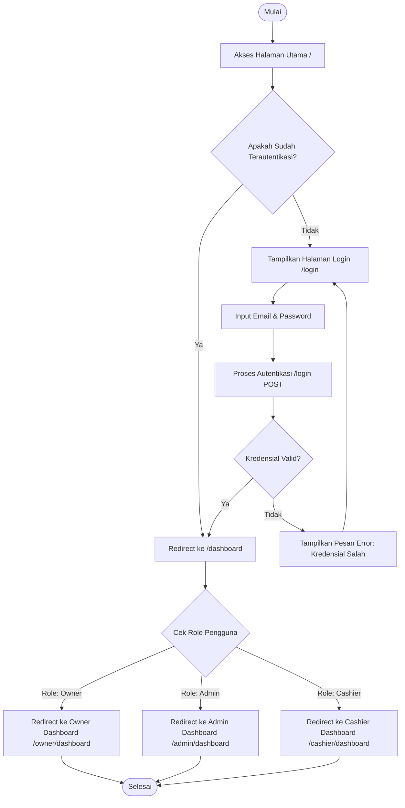
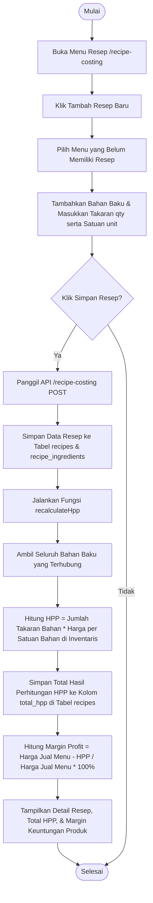

# Cafinity POS - Flowchart Fitur Aplikasi

Dokumen ini menjelaskan alur kerja (flowchart) dari setiap fitur utama yang ada di dalam aplikasi **Cafinity POS (Point of Sale & Cafe Management System)**. Setiap diagram menggunakan sintaks [Mermaid](https://mermaid.js.org/) untuk visualisasi alur data dan interaksi pengguna.

---

## Daftar Isi
1. [Fitur 1: Autentikasi & Otorisasi Pengguna (Role-Based Access Control - RBAC)](#fitur-1-autentikasi--otorisasi-pengguna-role-based-access-control---rbac)
2. [Fitur 2: Transaksi Point of Sale (POS)](#fitur-2-transaksi-point-of-sale-pos)
3. [Fitur 3: Antrean Dapur Real-time (Live Kitchen Queue)](#fitur-3-antrean-dapur-real-time-live-kitchen-queue)
4. [Fitur 4: Recipe Costing & Perhitungan HPP](#fitur-4-recipe-costing--perhitungan-hpp)
5. [Fitur 5: Manajemen Inventaris & Log Persediaan (Stock Control & PO)](#fitur-5-manajemen-inventaris--log-persediaan-stock-control--po)
6. [Fitur 6: Laporan Bisnis & Target Penjualan](#fitur-6-laporan-bisnis--target-penjualan)

---

## Fitur 1: Autentikasi & Otorisasi Pengguna (Role-Based Access Control - RBAC)

Sistem ini memiliki pembagian hak akses (role) menggunakan library **Spatie Laravel Permission** untuk mengamankan akses ke halaman tertentu berdasarkan peran masing-masing pengguna:
* **Owner**: Memiliki kontrol penuh atas semua menu, laporan keuangan, pengaturan target, manajemen user, serta role-permission matrix.
* **Admin**: Berfokus pada manajemen stok bahan baku, resep/HPP, katalog menu, dan proses Purchase Order (PO).
* **Cashier**: Berfokus pada penjualan (POS), riwayat transaksi harian, invoice, dan pencatatan kasir.

### Diagram Alur Autentikasi & Redirect Dashboard


---

## Fitur 2: Transaksi Point of Sale (POS)

Modul kasir memiliki 3 alur utama:
1. **Checkout & Pembayaran**: Proses normal pemesanan dari keranjang belanja hingga pembayaran dan pembuatan order untuk dapur.
2. **Hold & Resume Transaksi**: Menunda pesanan pelanggan saat antrean sibuk (misalnya pelanggan ingin menambah pesanan atau mengambil dompet) dan memulihkannya kembali nanti.
3. **Refund Transaksi**: Pengembalian dana transaksi yang telah selesai.

### Diagram Alur Transaksi POS & Refund
```mermaid
graph TD
    A([Mulai POS]) --> B[Pilih Menu Makanan/Minuman]
    B --> C[Masukkan Kuantitas & Catatan Khusus]
    C --> D[Tambahkan ke Keranjang Belanja]
    D --> E{Pilihan Aksi?}
    
    %% Alur Hold Transaksi
    E -- Tunda / Hold Transaksi --> F[Klik Tombol Hold]
    F --> G[Panggil API /pos/hold]
    G --> H[Simpan Transaksi dengan Status 'held']
    H --> I([Transaksi Ditangguhkan])
    
    %% Alur Resume Transaksi
    J([Memulai Kembali Transaksi 'held']) --> K[Buka Daftar Pesanan Ditunda]
    K --> L[Klik Resume pada Pesanan #HOLD]
    L --> M[Panggil API /pos/resume/{id}]
    M --> N[Ubah Status Transaksi Menjadi 'pending' & Ambil Item]
    N --> D
    
    %% Alur Checkout & Pembayaran
    E -- Checkout & Bayar --> O[Pilih Diskon/Promosi & Hitung Pajak]
    O --> P[Input Jumlah Bayar & Metode Pembayaran]
    P --> Q[Klik Bayar / Panggil API /pos/checkout]
    Q --> R[Mulai Transaksi Database]
    R --> S[Buat Record Transaksi Baru dengan Status 'completed']
    S --> T[Buat Detail Item Penjualan di Tabel transaction_items]
    T --> U[Buat Record Antrean Dapur di Tabel kitchen_orders status 'pending']
    U --> V[Ubah Status Transaksi Asal 'held' Menjadi 'cancelled' jika Resume]
    V --> W[Commit Transaksi Database]
    W --> X[Tampilkan Halaman Invoice / Cetak Struk Penjualan]
    X --> Y([Transaksi Selesai])
    
    %% Alur Refund Transaksi
    Y --> Z{Apakah Transaksi Perlu Refund?}
    Z -- Ya --> AA[Buka Riwayat Transaksi /transactions/{id}]
    AA --> AB[Klik Tombol Refund / Panggil API /transactions/{id}/refund]
    AB --> AC{Apakah Transaksi Sudah Direfund?}
    AC -- Ya --> AD[Tampilkan Pesan Error: Sudah Direfund] --> AE([Selesai])
    AC -- Tidak --> AF[Ubah Status Transaksi Menjadi 'refunded']
    AF --> AG[Tampilkan Notifikasi Refund Sukses] --> AE
    Z -- Tidak --> AE
```

---

## Fitur 3: Antrean Dapur Real-time (Live Kitchen Queue)

Setiap transaksi POS yang berhasil akan secara otomatis memicu pembuatan entri baru di modul dapur (`kitchen_orders`). Staf dapur dapat melacak pesanan dan memperbarui statusnya secara real-time.

### Diagram Transisi Status Antrean Dapur
```mermaid
graph TD
    A([Transaksi POS Selesai]) --> B[Sistem Membuat Record kitchen_orders status 'pending']
    B --> C[Pesanan Tampil di Layar Dapur /kitchen-orders]
    C --> D{Staf Dapur Memperbarui Status?}
    
    %% Proses Memasak
    D -- Klik Mulai Masak / Prepare --> E[Panggil API /kitchen-orders/{id}/prepare]
    E --> F[Update Status ke 'preparing']
    F --> G[Set Waktu Mulai Masak prepared_at]
    G --> C
    
    %% Proses Siap Saji
    D -- Klik Siap / Ready --> H[Panggil API /kitchen-orders/{id}/ready]
    H --> I[Update Status ke 'ready']
    I --> J[Kirim Notifikasi ke Kasir / Layar Pengambilan]
    J --> C
    
    %% Selesai
    D -- Klik Selesai / Complete --> K[Panggil API /kitchen-orders/{id}/complete]
    K --> L[Update Status ke 'completed']
    L --> M[Set Waktu Selesai completed_at]
    M --> N[Sistem Menghitung Rata-rata Waktu Memasak Hari Ini]
    N --> O([Makanan/Minuman Diterima Pelanggan])
```

---

## Fitur 4: Recipe Costing & Perhitungan HPP

Modul ini membantu Owner dan Admin mengelola resep untuk setiap menu. Sistem akan secara otomatis menghitung Harga Pokok Penjualan (HPP) berdasarkan bahan baku yang terdaftar di inventaris dan menghitung persentase margin keuntungan produk.

### Diagram Alur Input Resep & Kalkulasi HPP Otomatis


---

## Fitur 5: Manajemen Inventaris & Log Persediaan (Stock Control & PO)

Sistem inventaris mencakup pencatatan bahan baku, penyesuaian stok secara manual, Purchase Order (PO) ke supplier, serta notifikasi otomatis saat stok mendekati batas kritis (low-stock).

### Diagram Alur Manajemen Stok & Purchase Order (PO)
```mermaid
graph TD
    A([Mulai]) --> B[Akses Menu Inventaris /inventories]
    B --> C{Pilih Tindakan Stok?}
    
    %% Alur Restock Manual
    C -- Restock Manual --> D[Klik Restock & Input Jumlah qty Baru]
    D --> E[Panggil API /inventories/{id}/restock]
    E --> F[Fungsi adjustStock Tipe 'restock' Dijalankan]
    F --> G[Stok Bertambah & Histori Perubahan Dicatat di inventory_logs]
    G --> H[Tampilkan Status Stok Terbaru]
    
    %% Alur Purchase Order (PO)
    C -- Buat Purchase Order --> I[Pilih Supplier & Pilih Item Bahan Baku]
    I --> J[Input Jumlah qty, Satuan, dan Harga Satuan Pembelian]
    J --> K[Simpan PO dengan Status Awal 'pending']
    K --> L{Keputusan Owner / Akses PO?}
    L -- Tolak PO --> M[Owner Memanggil API /purchase-orders/{id}/reject]
    M --> N[Ubah Status PO Menjadi 'rejected'] --> O([Proses PO Berakhir])
    L -- Setujui PO --> P[Owner Memanggil API /purchase-orders/{id}/approve]
    P --> Q[Ubah Status PO Menjadi 'approved']
    Q --> R[Barang Dikirim Supplier & Tiba di Kafe]
    R --> S[Admin Klik Terima Barang / Panggil API /purchase-orders/{id}/receive]
    S --> T[Mulai Transaksi Database]
    T --> U[Loop Setiap Item PO: Panggil adjustStock Tipe 'in' dengan Deskripsi PO]
    U --> V[Stok Bahan Baku Bertambah & Histori Dicatat di inventory_logs]
    V --> W[Ubah Status PO Menjadi 'received' & Set received_at]
    W --> X[Commit Transaksi Database] --> H
    
    %% Peringatan Stok Rendah
    H --> Y{Apakah Stok <= Batas Min Stok min_stock?}
    Y -- Ya --> Z[Tampilkan Peringatan Stok Rendah / Low Stock Warning]
    Y -- Tidak --> AA[Tampilkan Status Stok Aman]
    Z --> AB([Selesai])
    AA --> AB
```

---

## Fitur 6: Laporan Bisnis & Target Penjualan

Fitur ini diperuntukkan bagi Owner untuk memantau performa bisnis dan mengatur target penjualan harian/bulanan agar kemajuan bisnis dapat diukur dengan jelas.

### Diagram Alur Laporan & Target Penjualan
```mermaid
graph TD
    A([Mulai]) --> B[Owner Mengakses Menu Target /targets-goals atau Laporan /reports]
    B --> C{Pilih Sub-Modul?}
    
    %% Modul Target
    C -- Atur Target Penjualan --> D[Input Nominal Target Penjualan Harian/Bulanan]
    D --> E[Simpan Target ke Database]
    E --> F[Dashboard Owner Menampilkan Progress Realisasi vs Target Penjualan]
    
    %% Modul Laporan & Profit/Loss
    C -- Analisis Penjualan & Laba Rugi --> G[Pilih Periode Tanggal Laporan]
    G --> H[Sistem Mengambil Data Penjualan (Completed) & Total HPP dari Resep]
    H --> I[Hitung Omzet Penjualan & Laba Bersih Omzet - HPP]
    I --> J[Tampilkan Grafik Pendapatan, Profitabilitas, & Menu Terlaris]
    J --> K{Apakah Ingin Ekspor Dokumen?}
    K -- Ekspor PDF --> L[Panggil API /reports/export/pdf] --> M[Unduh File PDF Laporan Bisnis]
    K -- Ekspor Excel --> N[Panggil API /reports/export/excel] --> O[Unduh File Excel Laporan Bisnis]
    K -- Tidak --> P([Selesai])
    M --> P
    O --> P
    F --> P
```
